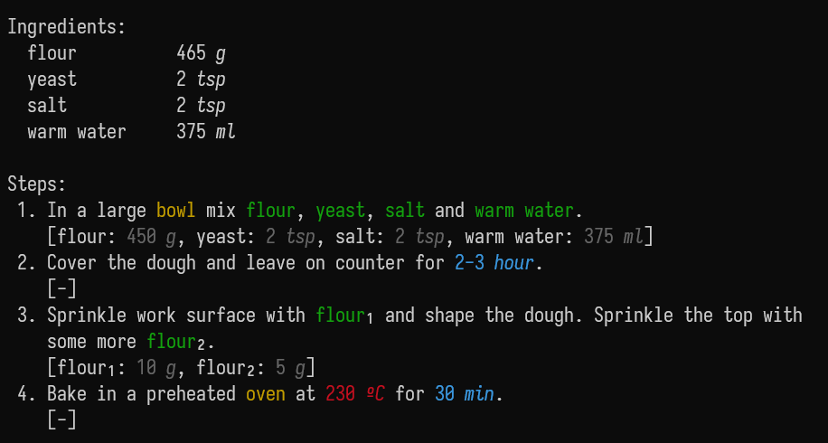

# cooklang-rs

A superset of [cooklang](https://cooklang.org/) and related tools.

> ⚠️ This is still work in progress ⚠️
>
> Almost everything work, but it is still work in progress and can change at any
> time.

## What is cooklang
Cooklang is a markup language for cooking recipes. An in depth explanation can
be found in [cooklang.org](https://cooklang.org/).

An example cooklang recipe:
```cooklang
In a large #bowl mix @flour{450%g}, @yeast{2%tsp}, @salt{2%tsp} and
@warm water{375%ml}.

Cover the dough and leave on counter for ~{2-3%hour}.

Sprinkle work surface with @&flour{10%g} and shape the dough. Sprinkle the top
with some more @&flour{5%g}.

Bake with a preheated #oven at 230ºC for ~{30%min}.
```


## What is this crate
I wanted a couple more feature that cooklang did not have, so I extended the
cooklang syntax and semantics a bit.

**All regular cooklang files parse as the same recipe**, the extensions
are a superset of the original cooklang format. Also, the
**extensions can be turned off**, so the parser can be used for regular cooklang
if you don't like the extensions.

You can see a detailed list of all extensions explained [here](./docs/extensions.md).

Full user documentation [here](./docs/main.md).

Some key features:
- [**CLI**](./docs/cli.md). All in one program to manage your recipes.
- **Ingredient references**. You can now refer to ingredients you already used
  before. I think the most important extension to the original cooklang. You can
  read about using references in [this document](./docs/using_references.md).
- **Good error reporting**. Error reports are a top priority. Specially those 
  related to parsing cooklang files.

  This little recipe contain errors:
  ```cooklang
  >> servings: 3|6|8

  Add @water{1%kg}, mix, and ~{5 min} later add more @&water{1|2%L}.
  ```
  

- **Units**. An ingredient quantity means nothing without a units. This is why
  the units are parsed a and checked. With units come:
  - Unit conversion. You can read your recipe in your prefered unit system.
  - Configurable units. You can add, remove and rename units.

## Crates

- [Cooklang parser](./cooklang/)
- [The CLI](./cli/). The CLI readme details it features and explains how to
  compile it.
- [cooklang-fs](./cooklang-fs). Utilities to deal with referencing recipe, 
  images and data related to recipes that are in other files.
- [cooklang-to-cooklang](./cooklang-to-cooklang). Recipe back to Cooklang.
- [cooklang-to-human](./cooklang-to-human). Write a recipe in a human friendly way.
- [cooklang-to-md](./cooklang-to-md). Recipe into Markdown.
