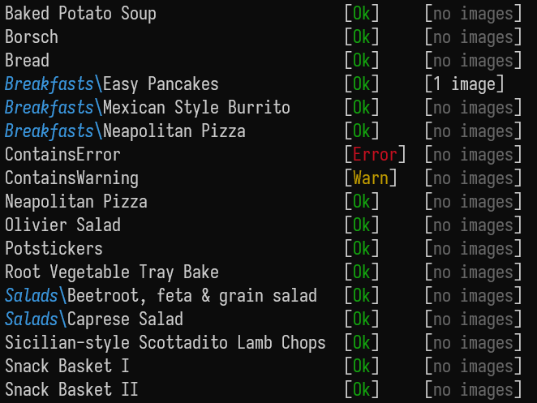

# The `cooklang-rs` CLI

The CLI is currently named `chef`. This may change. I don't want to
call it `cook` to avoid using the same name as the original `CookCLI`.

## Key features
- Read a recipe:
    ```sh
    chef recipe Bread.cook
    ```
    
    You can also specify a `markdown`, `json` or back to `cooklang` output.

- List all recipes, even check if they contain errors.
    ```sh
    chef recipe list --long
    ```
    

- List known units:
    ```sh
    chef units --long
    ```

- Quick conversions
    ```sh
    chef convert 3 cups metric
    ```


## Installing
### Prebuilt binaries
For now, prebuilt binaries are not distributed. However, maybe in
[the releases page](https://github.com/Zheoni/cooklang-rs/releases) you
can find one for Windows.

### Compiling the CLI
1. Install the rust compiler and `cargo`, the best way is with
[rustup](https://rustup.rs/).
2. Clone [this repo](https://github.com/Zheoni/cooklang-rs).
    ```sh
    git clone https://github.com/Zheoni/cooklang-rs
    cd cooklang-rs
    ```
3. Go into the `cli` dir
    ```sh
    cd cli
    ```
4. To install it, run:
    ```sh
    cargo install --path .
    ```
    This will install the cli in the `cargo` install dir, in your home dir.
    If you followed the instructions when using `rustup`, this dir should be
    in your `PATH` and the binary accesible.

5. Test it:
    ```sh
    chef --version
    ```
    This should print a usage guide.


## Configuration
A configuration [TOML](https://toml.io) file will be loaded by the CLI.
First, it will try to load it from `.cooklang/config.toml`, if that cannot
be found, a global configuration file will be loaded. If it does not
exist, it will be created with default values.

The configuration file can be override with the CLI args.

You can see the loaded configuration with:
```sh
chef config
```

### The configuration file
This is an example configuration file:
```toml
default_units = true        # use bundled units
warnings_as_errors = false  # treat any warning as an error
recipe_ref_check = true     # check recipe references
max_depth = 3               # max depth to search for recipe references
extensions = 'all'          # enabled extensions

[load]
units = ["path/to/a/units/file"]
aisle = "path/to/aisle.conf/file
```

`extensions` can be `all`, `none` or a map to extensions like this one
```toml
[extensions]
MULTINE_STEPS = true
INGREDIENT_MODIFIERS = true
INGREDIENT_NOTE = true
INGREDIENT_ALIAS = true
SECTIONS = true
ADVANCED_UNITS = true
MODES = true
TEMPERATURE = true
TEXT_STEPS = true
RANGE_STEPS = true
```

The paths in `load`, if relative, they are relative to the `toml` file.
