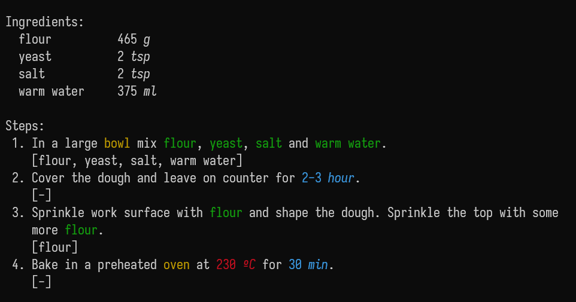

# Using references

Let's start with a simple bread recipe in cooklang without references.
```cooklang
In a large #bowl mix @flour{450%g}, @yeast{2%tsp}, @salt{2%tsp} and
@warm water{375%ml}.

Cover the dough and leave on counter for ~{2-3%hour}.

Sprinkle work surface with flour and shape the dough. Sprinkle the top with
some more flour.

Bake in a preheated #oven at 230ºC for ~{30%min}.
```

When we display this recipe we get this: 

Honestly, I would like the flour used in step 3 to be highlighted in green too.
But without references this would add a new ingredient to the list, which we do
not want.

## Marking references as such
If we mark the flour in step 3 as an ingredient (`@`) with the reference
modifier (`&`):
```cooklang
[- ... -]

Sprinkle work surface with @&flour and shape the dough. Sprinkle the top with
some more @&flour.

[- ... -]
```
or just set duplicate mode to reference and use regular ingredients:
```cooklang
>> [duplicate]: ref
[- ... -]

Sprinkle work surface with @flour and shape the dough. Sprinkle the top with
some more @flour.

[- ... -]
```


Now all uses of flour are marked!

I prefer the duplicate mode method, and that's how this guide will continue, but
marking each reference as such is possible too.

But, how much flour do we have to use in step 3?

## Adding more to the total
Just add the amount to the references.
```cooklang
>> [duplicate]: ref
[- ... -]

Sprinkle work surface with @flour{10%g} and shape the dough. Sprinkle the top
with some more @flour{5%g}.

[- ... -]
```


Now we know exactly how much flour we should use. Notice also how in the
ingredient list the total amount is calculated too. This will work if the units
are different too if they are compatible and the parser knows how to convert
them.

## A list of ingredients
But imagine you have the recipe with the classic format of an ingredient list
followed by the steps, and you don't want to translate every use to an exact
amount. You can use ingredient references and set the define mode to ingredients
or steps to do this.

In ingredients mode, all text is ignored, just the components are stored.

We don't have to mark ingredients as reference in steps mode, as every
ingredient is already a reference.
```cooklang
>> [define]: ingredients
- @flour{465%g}
- @yeast{2%tsp}
- @salt{2%tsp}
- @warm water{375%ml}

>> [define]: steps
In a large #bowl mix @flour, @yeast, @salt and
@warm water{}.

Cover the dough and leave on counter for ~{2-3%hour}.

Sprinkle work surface with @flour and shape the dough. Sprinkle the top with
some more @flour.

Bake in a preheated #oven at 230ºC for ~{30%min}.
```


Obviously, we lose the amounts in each use. Don't try to add those amounts, it
is an error.
```cooklang
[- ... -]

Sprinkle work surface with @flour{10%g} and shape the dough. Sprinkle the top
with some more @flour.

[- ... -]
```
 This is because it's confusing when trying to add the
values to calculate the total quantity.

However, if we dont add a quantity in the ingredient list, we can add it on the
references. This is allowed but probably not very useful because then the
ingredient list has little value.
```cooklang
[- ... -]
- @flour
[- ... -]
Sprinkle work surface with @flour{10%g} and shape the dough. Sprinkle the top
with some more @flour{5%g}.
[- ... -]
```

## Using intermediate ingredients
_This is another extension extending the modifiers extension._

The last thing we can reference are ingredients that we create during the
recipe. For example, in step 3 we shape the dough from the last step. We can
express that with intermediate ingredients references.
```cooklang
[- ... -]
Sprinkle work surface with @flour{10%g} and shape the @&(~1)dough. Sprinkle the
top with some more @flour{5%g}.
[- ... -]
```


